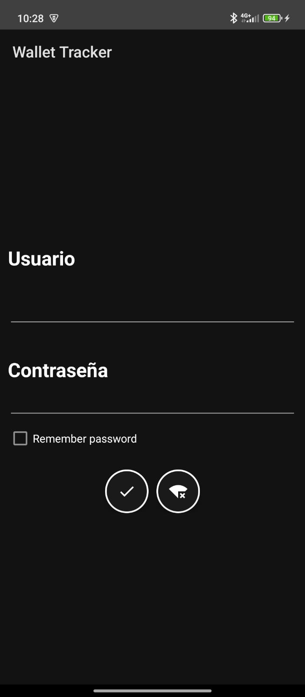
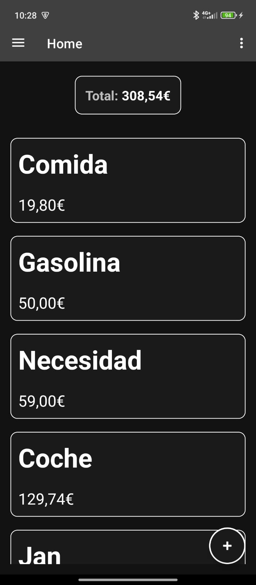

# Wallet Tracker

An Android expense tracking app built in Kotlin with end-to-end encryption, biometric authentication, and a fully automated CI/CD pipeline.

## Features

### Expense Management
- Create and manage expense categories with custom names
- Log expenses with amount, date, and category
- Browse expenses per category
- Import expenses from spreadsheets

### Metrics & Analytics
- View total spending, expense count, and average per expense
- Breakdown by category with percentage bars
- Monthly breakdown with progress indicators
- Filter metrics by category and/or month

### Offline & Online Mode
The app supports two modes controlled at runtime:
- **Online mode** — syncs data with the backend API, leveraging end-to-end encrypted communication
- **Offline mode** — all data is stored locally in SQLite; no network required

The active mode is injected via Hilt (`AppMode`) and repository implementations swap transparently between HTTP services and SQLite services.

### Biometric Login
- Login with fingerprint or device biometrics via Android BiometricPrompt
- Credentials are retrieved securely from the local session store after biometric verification
- Falls back to username/password login

### End-to-End Cryptography
All API communication is encrypted using a hybrid RSA + AES/GCM scheme:

1. **Key exchange** — on registration, the client generates a 2048-bit RSA key pair and exchanges public keys with the server
2. **Hybrid encryption** — outgoing requests are encrypted with AES-256-GCM; the AES key is encrypted with the server's RSA public key (OAEP/SHA-256)
3. **Request signing** — each request is signed using RSA/PSS (SHA-256) with the client's private key; the server verifies the signature
4. **Response decryption** — responses are decrypted using the client's RSA private key to unwrap the AES key, then AES/GCM to decrypt the payload

Keys are stored in the local SQLite session table and never leave the device unencrypted.

## CI/CD Pipeline

The GitHub Actions CD workflow triggers on every push to `main`:

1. **Version extraction** — reads `majorVersion`, `minorVersion`, `patchVersion` from `app/build.gradle.kts` to derive the release tag (e.g. `v1.2.3`)
2. **Duplicate check** — skips all subsequent steps if a GitHub release for that tag already exists
3. **Vault secrets** — fetches signing credentials and build config from a self-hosted HashiCorp Vault instance (`vault.downops.win`) using a scoped token; secrets include the keystore, passwords, key alias, API base URL, and the signing secret word
4. **Build** — compiles a release APK with Gradle on JDK 17
5. **Sign** — zipaligns and signs the APK with `apksigner` using the keystore retrieved from Vault
6. **GitHub Release** — publishes a new release with the signed APK attached and auto-generated release notes, marked as latest

Signing keys and secrets are never stored in the repository; they exist exclusively in Vault and are injected at build time.

## Tech Stack

- **Language**: Kotlin
- **Architecture**: MVVM + Repository pattern
- **Dependency injection**: Hilt
- **Database**: SQLite via `DatabaseHelper` (custom helper, no ORM)
- **Networking**: Retrofit + OkHttp
- **Cryptography**: Java Security (`RSA/ECB/OAEPWithSHA-256AndMGF1Padding`, `AES/GCM/NoPadding`, `SHA256withRSA/PSS`)
- **Biometrics**: AndroidX BiometricPrompt
- **Secrets management**: HashiCorp Vault

## Screenshots

